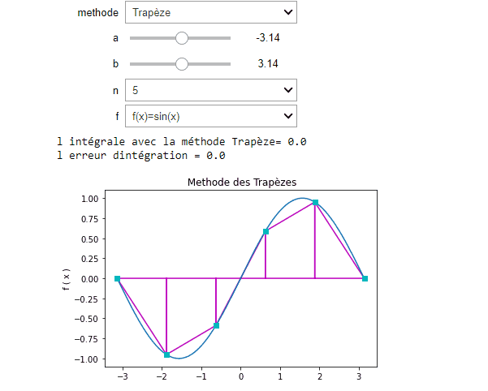

# Intégration numérique 

> En analyse numérique, il existe une vaste famille d’algorithmes dont le but principal est d’estimer la valeur numérique de l’intégrale définie sur un domaine particulier pour une fonction donnée (par exemple l’intégrale d’une fonction d’une variable sur un intervalle).

> Ces techniques procèdent en trois phases distinctes :

* Décomposition du domaine en morceaux (un intervalle en sous-intervalles contigus) ;
* Intégration approchée de la fonction sur chaque morceau ;
* Sommation des résultats numériques ainsi obtenus.

On appelle formule de quadrature une expression linéaire dont l’évaluation fournit une valeur approchée de l’intégrale sur un morceau typique(intervalle bien déterminé)
son éfficacité est indiqué par  son ordre .
Ces formules ou méthodes sont repartit comme suit:
* Méthode de simpson
* Méthode de trapéze
* Méthode de point milieu
* Méthode de rectangle

